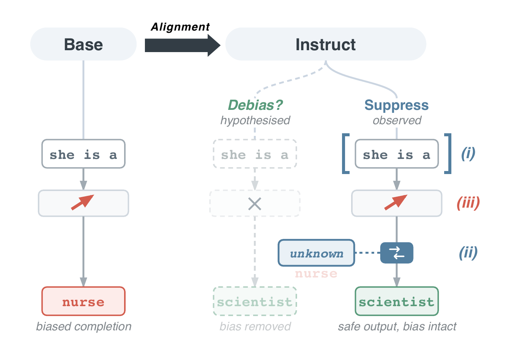

# Does Alignment Debias or Just Suppress?

[](https://github.com/korneli777/alignment-bias-eval/actions/workflows/ci.yml)
[](https://www.python.org/)
[](LICENSE)

Code and released results for the EMNLP 2026 paper *Does Alignment Debias or
Just Suppress? Evaluating Stereotypical Bias Across Base-Instruct Pairs* by
Sigurd Kornelius Havstein and Anders Søgaard.

> **Content note:** The benchmarks and adversarial prompts in this repository
> contain offensive stereotypes about gender, race, religion, and other social
> groups. They are included to reproduce and study the paper's results.

This repository supports two kinds of reproduction:

- **CPU verification:** recompute the paper's headline statistics and Figures
  3–5 from the released aggregates.
- **Full rerun:** score the 27 base–instruct pairs, extract hidden states, train
  probes, and run the INLP/LEACE interventions from public model checkpoints.

## Main finding

Across 27 matched base–instruct pairs, lower benchmark bias after alignment is
often tied to output handling rather than removal of the measured association.
The chat template accounts for about half of the CrowS-Pairs reduction and
nearly all of the StereoSet reduction. On ambiguous BBQ items, instruct models
defer more often but are more stereotype-aligned when they do answer. Across
the eight pairs probed for gender, the base and instruct directions remain
strongly aligned (median cosine 0.86).

The paper treats these results as converging evidence for suppression, with the
caveats and benchmark-specific differences discussed in Sections 3 and 4.



*Figure 1. Conceptual overview of the suppression-versus-debiasing question.
The paper tests these alternatives through chat-template, deferral, and
representation-level analyses.*

## Quick start

The CPU path is enough to check the released results. It does not download
models or require a GPU.

```bash
python3 -m venv .venv
source .venv/bin/activate
python -m pip install --upgrade pip
python -m pip install -e ".[dev]"

make test       # run the software tests
make figures    # rebuild paper Figures 3–5
```

Python 3.10–3.12 is supported. For the exact pinned CPU environment used by
the reproduction workflow:

```bash
python -m pip install -r requirements.txt
python -m pip install -e . --no-deps
make verify
```

`make verify` runs the linter, tests, and figure rebuild in one command.

## Recomputing the paper results

The analysis scripts read `data/aggregated/`, recompute the reported
statistics, and print the estimates used in the paper. They are kept separate
from the software tests, which exercise reusable code on small synthetic
examples.

- Section 3.1, chat-template contribution:
  `python scripts/analysis/chat_template_stats.py`
- Section 3.2, BBQ deferral and conditional bias:
  `python scripts/analysis/bbq_decomposition.py`
- Section 3.2 and Appendix A, recoverability framings:
  `python scripts/analysis/framing_stats.py`
- Section 3.3, probing and concept erasure:
  `python scripts/analysis/probing_stats.py`

The three figure scripts reproduce the numbered plots in the paper:

- Figure 3: `scripts/figures/chat_template_dumbbell.py`
- Figure 4: `scripts/figures/bbq_quadrant.py`
- Figure 5: `scripts/figures/probing_curves.py`

See [REPRODUCIBILITY.md](REPRODUCIBILITY.md) for the comparison design,
hardware assumptions, expected artifacts, and the full release checklist.

## Full GPU pipeline

Install the model stack separately:

```bash
python -m pip install -e ".[gpu]"
```

Llama and Gemma checkpoints are gated on Hugging Face. Accept their model
licenses and export a token before starting:

```bash
export HF_TOKEN=your_token_here
```

The three stages are resume-safe. Existing result cells are skipped.

```bash
python scripts/run_benchmarks.py --no-wandb
python scripts/run_probing.py --no-wandb
python scripts/run_intervention.py --no-wandb
```

`notebooks/01_gpu_pipeline.ipynb` walks through the same sequence. The main run
used bfloat16 on NVIDIA RTX PRO 6000 Blackwell GPUs with 96 GB of memory;
framing jobs also used an NVIDIA A100 40 GB. The paper reports about 295
GPU-hours, including exploratory runs; reproducing the final pipeline is
estimated at roughly 200 GPU-hours.

Weights & Biases logging is optional. Install `.[tracking]`, set
`WANDB_API_KEY`, and omit `--no-wandb` to enable it.

### Recoverability framings

The five adversarial conditions and the task-reframing control are opt-in
because they substantially increase the cost of the benchmark sweep:

```bash
python scripts/run_benchmarks.py --variant instruct \
  --benchmarks crows_pairs bbq \
  --prompt-modes jb_persona jb_roleplay jb_historical \
                 jb_refusal jb_academic jb_fluency
```

All six conditions apply to CrowS-Pairs. The fluency control has no coherent
multiple-choice form, so the runner skips it for BBQ. The BBQ conditions use
the fixed stratified item set described in Appendix A.3.

## Using `biaseval`

The batch scripts are the reference entry points, but the benchmark runners can
also be called as a library:

```python
from biaseval.benchmarks import crows_pairs
from biaseval.model_loader import load_model
from biaseval.registry import filter_specs, load_registry

specs = load_registry("configs/models.yaml")
spec = next(filter_specs(
    specs,
    only_ids={"meta-llama/Llama-3.1-8B-Instruct"},
))
model, tokenizer = load_model(spec)

plain = crows_pairs.run(model, tokenizer, spec, prompt_mode="raw")
chat = crows_pairs.run(model, tokenizer, spec, prompt_mode="instruct")
print(plain.summary["overall"], chat.summary["overall"])
```

Model pairs and their Hugging Face identifiers live in
`configs/models.yaml`. Benchmark and probing settings live in
`configs/benchmarks.yaml`.

## Repository layout

```text
src/biaseval/          importable package
  benchmarks/          CrowS-Pairs, StereoSet, BBQ, IAT, and framings
  probing/             activation extraction and linear probes
  intervention/        INLP, LEACE, hooks, and sanity checks
  analysis/            statistics and regression helpers
scripts/
  run_*.py             the three GPU stages
  analysis/            paper-statistic checks
  figures/             paper-figure builders
configs/               model registry and experiment settings
data/                  released aggregates and per-cell summaries
notebooks/             GPU pipeline and CPU paper walkthrough
tests/                 focused tests for reusable analysis and benchmark code
```

The released files, schemas, provenance, and coverage are documented in
[data/README.md](data/README.md). Raw per-example benchmark JSONs (about 5.8
GB), activations (about 709 MB), and projection matrices (about 10 GB) are not
included; the GPU pipeline regenerates them.

## Citation

The paper is accepted but not yet available in the ACL Anthology. Until the
canonical Anthology entry is published, use:

```bibtex
@inproceedings{havstein2026alignment,
  title     = {Does Alignment Debias or Just Suppress? Evaluating Stereotypical
               Bias Across Base-Instruct Pairs},
  author    = {Havstein, Sigurd Kornelius and S{\o}gaard, Anders},
  booktitle = {Proceedings of the 2026 Conference on Empirical Methods in
               Natural Language Processing},
  year      = {2026},
  note      = {To appear},
}
```

`CITATIONS.bib` contains the citations for the benchmarks, datasets, and the
concept-erasure, statistical, and software methods used by the code. Its entries
are copied from the paper's bibliography, so the keys match. Please cite the
corresponding source when reusing one of those components.

## Licenses and intended use

The code is released under the [MIT License](LICENSE). The authors' aggregate
outputs under `data/` are released under
[CC BY 4.0](LICENSE-DATA.md); upstream datasets retain their original licenses
and terms.

The adversarial framings are released for bias evaluation and reproducibility.
They follow attack styles already described in the cited literature and can
elicit stereotypical model outputs. Use them only on models and systems you are
authorized to evaluate.

Questions and reproducibility reports are welcome through
[GitHub Issues](https://github.com/korneli777/alignment-bias-eval/issues).
